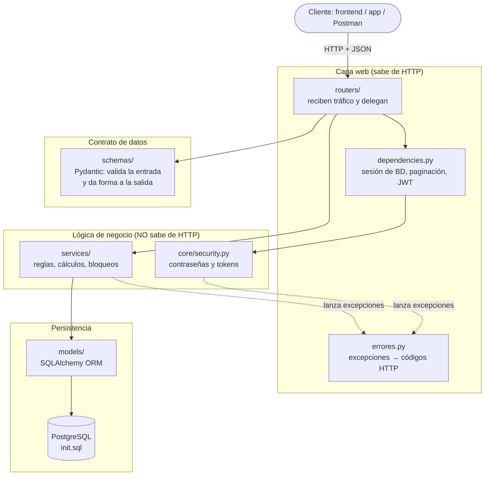
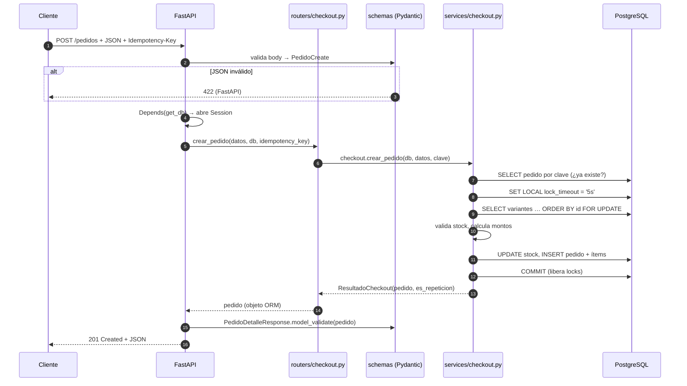
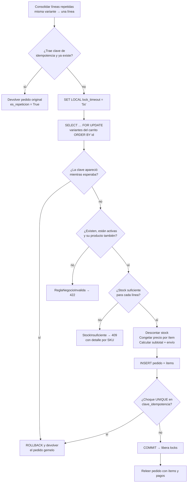
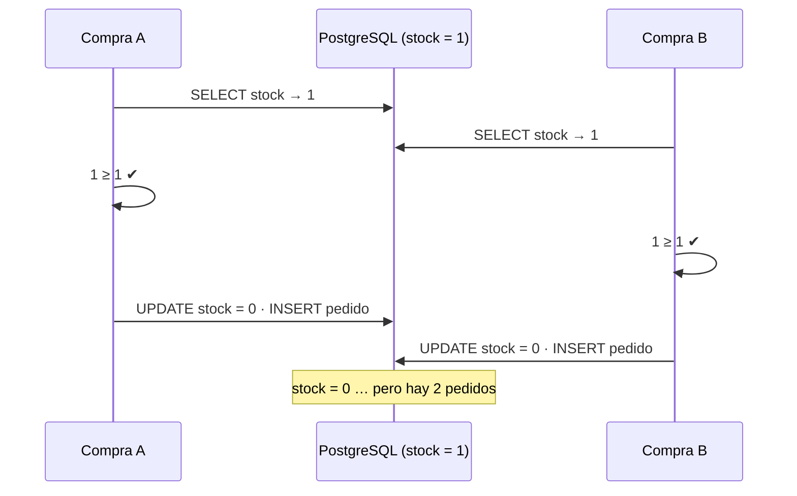
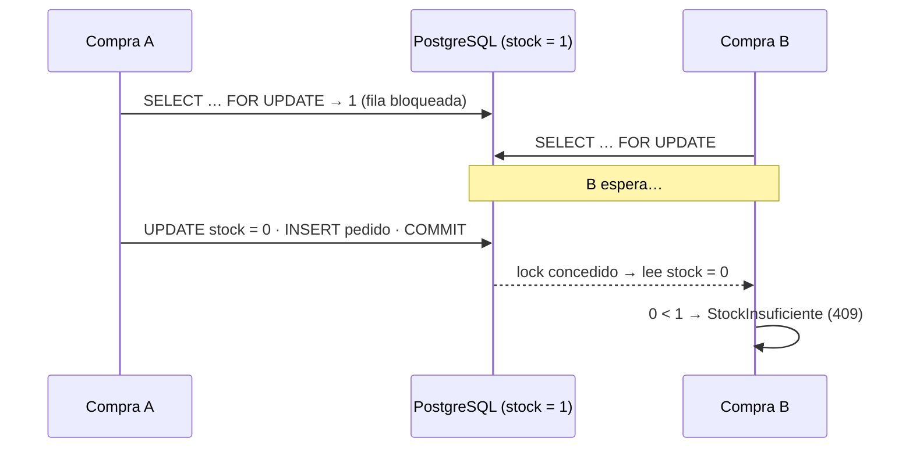
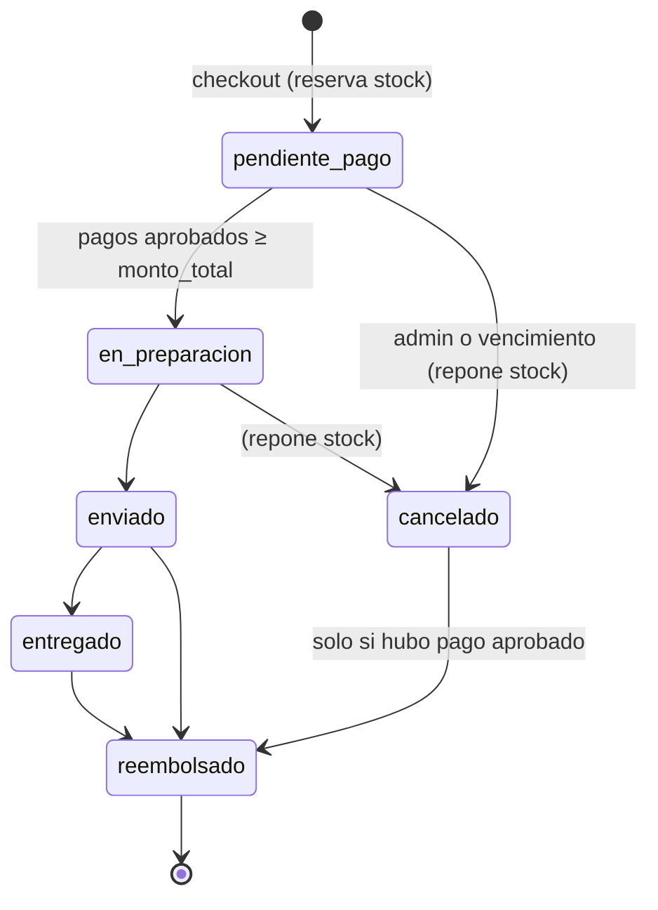
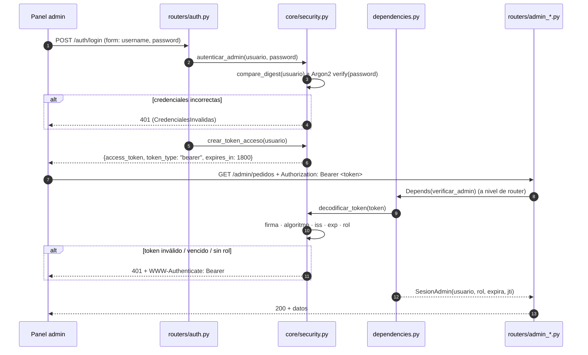

# Arquitectura del Backend — Sprint 3

> **Motor E-Commerce Headless** · FastAPI + SQLAlchemy 2 + PostgreSQL
> **Nota (Sprint 4):** las migraciones ahora se gestionan con Alembic, la suite de pruebas
> pasó a `pytest` (`tests/test_*.py`) y se agregaron rate limiting, tareas programadas y
> logging estructurado. La operación del servidor está en
> [`infraestructura_produccion_sprint4.md`](infraestructura_produccion_sprint4.md).
>
> Documento de estudio: recorre el camino que sigue la información desde que un JSON
> entra por HTTP hasta que queda guardado en PostgreSQL, y explica las decisiones
> de diseño (concurrencia, idempotencia, seguridad JWT) con el código real del proyecto.

---

## Índice

1. [La idea central: capas con una sola responsabilidad](#1-la-idea-central-capas-con-una-sola-responsabilidad)
2. [Mapa del proyecto](#2-mapa-del-proyecto)
3. [El viaje de un pedido, paso a paso](#3-el-viaje-de-un-pedido-paso-a-paso)
4. [Concurrencia: cómo evitamos vender la misma unidad dos veces](#4-concurrencia-cómo-evitamos-vender-la-misma-unidad-dos-veces)
5. [Idempotencia: el doble clic que no duplica pedidos](#5-idempotencia-el-doble-clic-que-no-duplica-pedidos)
6. [Ciclo de vida del pedido y pagos SINPE](#6-ciclo-de-vida-del-pedido-y-pagos-sinpe)
7. [La capa de seguridad JWT](#7-la-capa-de-seguridad-jwt)
8. [Privacidad del seguimiento público](#8-privacidad-del-seguimiento-público)
9. [Integridad garantizada por el motor](#9-integridad-garantizada-por-el-motor)
10. [Cómo se traducen los errores a HTTP](#10-cómo-se-traducen-los-errores-a-http)
11. [Seed, migraciones y pruebas](#11-seed-migraciones-y-pruebas)
12. [Cómo ejecutar el proyecto](#12-cómo-ejecutar-el-proyecto)
13. [Deuda técnica y próximos pasos](#13-deuda-técnica-y-próximos-pasos)
14. [Glosario](#14-glosario)

---

## 1. La idea central: capas con una sola responsabilidad

Todo el backend se organiza alrededor de una regla: **cada capa hace una sola cosa y
solo conoce a la capa de abajo**.



| Capa | Pregunta que responde | Lo que **no** hace |
|---|---|---|
| **Router** | ¿Qué URL y verbo atiendo, y a quién delego? | No calcula, no consulta la BD, no decide reglas |
| **Schema** | ¿Este JSON tiene la forma y los valores correctos? | No sabe si la variante existe ni si hay stock |
| **Service** | ¿Qué dice el negocio? ¿Cómo garantizo consistencia? | No conoce códigos HTTP ni headers |
| **Model** | ¿Cómo se mapea una fila a un objeto Python? | No tiene lógica de negocio |
| **PostgreSQL** | Última línea de defensa: tipos, `CHECK`, `UNIQUE`, FKs | — |

**¿Por qué tanto orden?** Porque cada pieza se puede probar y cambiar por separado. El
servicio de checkout, por ejemplo, se prueba sin levantar ningún servidor web (la suite
de integración lo llama directamente desde 40 hilos), y mañana podría usarse desde una
tarea programada o una cola de mensajes sin tocar una línea.

---

## 2. Mapa del proyecto

```
motor_ecommerce/
├── main.py                  # Ensambla la app: CORS, manejadores de error, routers
├── database.py              # Engine, SessionLocal, Base declarativa, get_db()
├── dependencies.py          # Dependencias FastAPI: DbSession, PaginacionDep, verificar_admin (JWT)
├── errores.py               # Traduce excepciones de dominio / BD / seguridad a HTTP
├── init.sql                 # DDL oficial: tablas, ENUMs, triggers, índices
│
├── core/                    # Infraestructura transversal
│   ├── config.py            #   Settings tipados leídos del .env (pydantic-settings)
│   └── security.py          #   Argon2id + JWT (emitir y validar tokens)
│
├── models/                  # SQLAlchemy ORM (espejo de init.sql)
│   ├── mixins.py            #   UUID PK + created_at/updated_at reutilizables
│   ├── catalogo.py          #   Categoria, Marca, Producto, VarianteProducto, ImagenProducto
│   └── transacciones.py     #   Pedido, ItemPedido, PagoSinpe + ENUMs
│
├── schemas/                 # Pydantic V2: contratos de entrada/salida
│   ├── base.py              #   BaseSchema, UpdateSchema, ResponseSchema, tipos (Slug, Monto…)
│   ├── catalogo.py
│   ├── transacciones.py     #   PedidoCreate, DireccionEnvio, Provincia…
│   └── auth.py              #   TokenResponse, SesionResponse
│
├── services/                # Lógica de negocio (sin HTTP)
│   ├── excepciones.py       #   RecursoNoEncontrado, StockInsuficiente, AccesoDenegado…
│   ├── bloqueos.py          #   SELECT … FOR UPDATE y lock_timeout
│   ├── checkout.py          #   ★ Carrito → pedido (concurrencia + idempotencia)
│   ├── pedidos.py           #   Máquina de estados, cancelación, vencimientos
│   ├── pagos.py             #   Registro y conciliación SINPE
│   ├── envio.py             #   Tarifa por provincia (estática en este sprint)
│   └── catalogo.py          #   CRUD y consultas del storefront
│
├── routers/
│   ├── catalogo.py          #   Público: GET categorías, marcas, productos, variantes
│   ├── checkout.py          #   Público: POST /pedidos, GET /pedidos/{id}, POST /pagos
│   ├── auth.py              #   POST /auth/login, GET /auth/sesion
│   ├── admin_catalogo.py    #   /admin/* (JWT): CRUD de catálogo
│   └── admin_pedidos.py     #   /admin/* (JWT): pedidos y conciliación
│
├── migrations/001_…sql      # Cambios del Sprint 3 para bases ya existentes
├── scripts/seed_catalogo.py # Datos iniciales del catálogo
└── tests/prueba_integracion.py  # Suite contra PostgreSQL real embebido
```

---

## 3. El viaje de un pedido, paso a paso

Seguiremos una petición real de punta a punta: un cliente compra 2 unidades de una
proteína y pide envío a Limón.



### 3.1 Entra el JSON

```http
POST /pedidos HTTP/1.1
Content-Type: application/json
Idempotency-Key: 6f1c2b7e-1d0a-4c55-9a51-2f0e8a9d7c41

{
  "cliente_nombre": "Ana Mora",
  "cliente_whatsapp": "+50688887777",
  "direccion_envio": {
    "provincia": "limon",
    "canton": "Limón",
    "distrito": "Centro",
    "senas_exactas": "Frente al parque Vargas, casa azul"
  },
  "items": [
    { "variante_id": "0b9d…", "cantidad": 1 },
    { "variante_id": "0b9d…", "cantidad": 1 }
  ]
}
```

Fíjate en lo que **no** viene: ni precios, ni subtotales, ni costo de envío, ni total,
ni estado. **El backend es la única fuente de verdad.** Si el cliente intentara mandar
`"monto_total": "1.00"`, la petición se rechaza (ver 3.3).

### 3.2 El router: recibir y delegar

`routers/checkout.py` — el endpoint completo cabe en cinco líneas útiles:

```python
@router.post("/pedidos", response_model=PedidoDetalleResponse, status_code=201)
def crear_pedido(datos: PedidoCreate, db: DbSession, response: Response,
                 idempotency_key: IdempotencyKey = None):
    resultado = checkout.crear_pedido(db, datos, clave_idempotencia=idempotency_key)
    if resultado.es_repeticion:
        response.headers["Idempotent-Replayed"] = "true"
    return resultado.pedido
```

Cada parámetro es una **inyección de dependencias** de FastAPI:

| Parámetro | De dónde sale | Qué garantiza |
|---|---|---|
| `datos: PedidoCreate` | Body JSON | Ya llega validado; si no, FastAPI respondió 422 antes de entrar |
| `db: DbSession` | `Depends(get_db)` en `dependencies.py` | Una `Session` nueva por request, cerrada siempre en el `finally` |
| `idempotency_key` | Header `Idempotency-Key` | 8–100 caracteres `[A-Za-z0-9_-]`, o ausente |
| `response: Response` | FastAPI | Permite agregar headers a la respuesta |

> **`get_db` y la transacción.** La sesión se abre al inicio del request y se cierra al
> final pase lo que pase. Si un servicio lanza una excepción antes de su `commit()`, el
> cierre hace *rollback* implícito: nunca queda una transacción a medias.

### 3.3 Los schemas: la aduana de los datos

`PedidoCreate` (en `schemas/transacciones.py`) hereda de `BaseSchema`, cuya
configuración aplica a toda entrada:

```python
class BaseSchema(BaseModel):
    model_config = ConfigDict(
        str_strip_whitespace=True,   # "  Ana  " → "Ana"
        extra="forbid",              # campos desconocidos → 422
    )
```

`extra="forbid"` es lo que convierte el intento de enviar `monto_total` en un error.
Luego, cada campo tiene sus reglas, que **replican las restricciones `CHECK` de
`init.sql`** para responder un 422 claro antes de molestar a la base de datos:

| Campo | Regla Pydantic | Restricción equivalente en BD |
|---|---|---|
| `cliente_whatsapp` | `pattern=^[+0-9]{8,20}$` | `chk_pedidos_whatsapp_format` |
| `items` | 1 a 50 líneas | — (anti-acaparamiento de stock) |
| `items[].cantidad` | `> 0` y `≤ 100` | `chk_items_cantidad_positiva` |
| `direccion_envio.provincia` | `Provincia` (ENUM de las 7 provincias) | — |

La provincia tiene además un **validador `before`** que normaliza la escritura:
`"limon"`, `"LIMÓN"` o `" Limon "` se convierten en el valor canónico `"Limón"`. Así,
los filtros posteriores sobre el JSONB (`direccion_envio->>'provincia'`) son
consistentes y el cálculo de envío no falla por una tilde.

> **Defensa en profundidad.** ¿Por qué validar en Pydantic *y* en PostgreSQL? Pydantic da
> mensajes útiles al cliente; PostgreSQL protege los datos aunque alguien escriba en la
> base saltándose la API (un script, una migración, otro servicio).

### 3.4 El servicio de checkout: donde vive la lógica

`services/checkout.py → crear_pedido()` ejecuta esta secuencia **dentro de una sola
transacción**:



Puntos clave del código:

**a) Consolidar el carrito.** Si llega la misma variante en dos líneas, se suman con un
`Counter`. Esto simplifica todo lo demás: una variante = una línea = un lock.

**b) Bloquear antes de leer el stock.** `bloquear_variantes()` (en `services/bloqueos.py`)
emite exactamente este SQL:

```sql
SELECT productos.*, variantes_producto.*
FROM variantes_producto JOIN productos ON productos.id = variantes_producto.producto_id
WHERE variantes_producto.id IN (…)
ORDER BY variantes_producto.id
FOR UPDATE OF variantes_producto
```

`FOR UPDATE OF variantes_producto` bloquea solo las filas de variantes (no los
productos), y `ORDER BY id` fija el orden en que se toman los locks. La sección 4
explica por qué ambas cosas importan.

**c) Calcular con `Decimal`, nunca con `float`.** El dinero se maneja como
`Decimal` de punta a punta (`NUMERIC(12,2)` en PostgreSQL). `0.1 + 0.2` en `float` da
`0.30000000000000004`; en `Decimal` da `0.3`. Todo se redondea a céntimos con
`ROUND_HALF_UP`.

**d) Congelar el precio.** Cada `ItemPedido` guarda `precio_unitario_historico` copiado
de la variante en ese instante. Si mañana el producto sube de precio, el pedido de hoy
no cambia: es un registro contable inmutable.

**e) Envío.** `services/envio.py` aplica una tabla por provincia (GAM ₡3 000, resto
₡4 000 — valores de referencia). El checkout solo llama a `calcular_costo_envio()`:
cuando llegue la logística avanzada, se reemplaza ese módulo sin tocar el checkout.

**f) Un solo `COMMIT`.** Descontar stock e insertar el pedido ocurren juntos o no ocurren.
Si cualquier paso falla, el rollback devuelve el stock automáticamente.

### 3.5 Los modelos y PostgreSQL: dónde se guarda

Los modelos de `models/` son el espejo de `init.sql`. Algunos detalles que el ORM
delega a la base de datos:

| Columna | Quién la llena | Cómo lo sabe el ORM |
|---|---|---|
| `id` (UUID) | `gen_random_uuid()` en PostgreSQL | `server_default` → lo recupera con `RETURNING` |
| `updated_at` | Trigger `set_updated_at_timestamp()` | `server_onupdate=FetchedValue()` → lo relee tras un UPDATE |
| `subtotal_linea` | Columna generada `cantidad * precio_unitario_historico` | `Computed(..., persisted=True)` → solo lectura |
| `estado_pedido` | ENUM `estado_pedido_enum` | `postgresql.ENUM(..., create_type=False)` |
| `atributos`, `direccion_envio` | JSONB | `MutableDict.as_mutable(JSONB)` detecta cambios in-place |

### 3.6 La respuesta: del objeto ORM al JSON

El router devuelve un objeto `Pedido` de SQLAlchemy. FastAPI lo pasa por
`PedidoDetalleResponse`, que hereda de `ResponseSchema`:

```python
class ResponseSchema(BaseModel):
    model_config = ConfigDict(from_attributes=True)  # lee atributos, no solo dicts
```

`from_attributes=True` permite que Pydantic lea `pedido.items`, `pedido.monto_total`,
etc., directamente del objeto ORM. El resultado:

```json
{
  "id": "a3f1…",
  "cliente_nombre": "Ana Mora",
  "cliente_whatsapp": "+50688887777",
  "direccion_envio": { "provincia": "Limón", "canton": "Limón", "distrito": "Centro",
                       "senas_exactas": "Frente al parque Vargas, casa azul" },
  "subtotal_productos": "25000.00",
  "costo_envio": "4000.00",
  "monto_total": "29000.00",
  "estado_pedido": "pendiente_pago",
  "fecha_creacion": "2026-10-06T15:42:10.118Z",
  "items": [ { "variante_id": "0b9d…", "cantidad": 2,
               "precio_unitario_historico": "12500.00", "subtotal_linea": "25000.00", "…": "…" } ],
  "pagos": []
}
```

Observa que los montos salen como **texto** (`"25000.00"`): así se serializa un
`Decimal` para no perder precisión en JavaScript. Las dos líneas de la misma variante
llegaron consolidadas en una sola con `cantidad: 2`.

---

## 4. Concurrencia: cómo evitamos vender la misma unidad dos veces

### 4.1 El problema: la "actualización perdida"

Imagina que queda **1 unidad** y dos clientes compran al mismo tiempo con un checkout
ingenuo (leer, verificar, escribir):



Ambos leyeron el mismo valor antes de que el otro escribiera. El `CHECK (stock >= 0)`
**no lo detecta**, porque el stock nunca llega a ser negativo: simplemente la segunda
escritura pisa a la primera.

La suite de pruebas incluye este checkout ingenuo como **experimento de control**: con
20 compradores por 1 unidad vendió entre **8 y 12 unidades** según la corrida.

### 4.2 La solución: bloqueo pesimista con `SELECT … FOR UPDATE`

`FOR UPDATE` dice a PostgreSQL: *"voy a modificar estas filas; que nadie más las
bloquee hasta que termine mi transacción"*.



La segunda transacción **espera** y, al continuar, lee el valor ya actualizado. Con el
checkout real, la misma prueba de 20 compradores da exactamente **1 venta y 19
rechazos**, siempre.

> **¿Pesimista u optimista?** El bloqueo optimista (columna `version` y reintentar si
> cambió) evita esperas, pero en un flash-sale casi todos los intentos chocarían y
> habría que reintentar muchas veces. El pesimista encola a los compradores de forma
> ordenada y la sección crítica dura milisegundos.

### 4.3 El orden de los locks evita deadlocks

Si el cliente A compra `[X, Y]` y el cliente B compra `[Y, X]`, y cada uno bloqueara en
el orden de su carrito:

```
A bloquea X ──── espera Y (lo tiene B)
B bloquea Y ──── espera X (lo tiene A)      → DEADLOCK
```

Por eso `bloquear_variantes()` toma **todas las variantes en una sola consulta con
`ORDER BY id`**: PostgreSQL adquiere los locks en el orden en que devuelve las filas, y
ese orden es el mismo para todos. Nadie puede tener Y mientras espera X.

El proyecto define un **orden global de adquisición** documentado en
`services/bloqueos.py`, que todo servicio respeta:

```
pedidos  →  pagos_sinpe  →  variantes_producto (siempre ordenadas por id)
```

Prueba: 40 compradores, mitad con `[X, Y]` y mitad con `[Y, X]` → 40 ventas, 0 deadlocks.

### 4.4 Nadie espera para siempre: `lock_timeout`

```python
db.execute(text("SET LOCAL lock_timeout = '5s'"))
```

`SET LOCAL` aplica solo a la transacción actual. Si un lock no llega en 5 s, PostgreSQL
aborta con el código `55P03` y `errores.py` responde **409 + `Retry-After: 1`**. Mejor
un error rápido y reintentable que un request colgado ocupando una conexión del pool.

### 4.5 `SKIP LOCKED` para tareas de fondo

`cancelar_pedidos_vencidos()` usa `FOR UPDATE SKIP LOCKED`: si un pedido está siendo
modificado por otra transacción, simplemente lo salta en vez de esperar. Así la tarea
puede correr en paralelo con el tráfico normal sin estorbar.

---

## 5. Idempotencia: el doble clic que no duplica pedidos

### 5.1 El problema

Un cliente con mala conexión pulsa "Pagar", no ve respuesta y pulsa otra vez. Sin
protección, se crean dos pedidos **y se reserva el doble de stock**. Una operación es
*idempotente* si repetirla produce el mismo resultado que hacerla una vez.

### 5.2 El mecanismo

1. El frontend genera una clave única por **intento de compra** (p. ej. un UUID v4) y la
   envía en el header `Idempotency-Key`. Si reintenta, reusa la misma clave.
2. El pedido guarda la clave en `pedidos.clave_idempotencia`, con restricción `UNIQUE`.
3. Ante una clave conocida, el servidor devuelve **el pedido original** con
   `201` y el header `Idempotent-Replayed: true`.

### 5.3 Los tres caminos del código

| Situación | Qué pasa |
|---|---|
| **Reintento posterior** (el primero ya terminó) | La búsqueda inicial por clave lo encuentra → se devuelve sin tocar stock |
| **Gemelos simultáneos** (mismo carrito) | El segundo espera los locks del primero; al obtenerlos **vuelve a buscar la clave** (ya es visible porque el primero confirmó) → `ROLLBACK` y se devuelve el original |
| **Carreras sin variantes en común** | Red de seguridad: el `INSERT` del segundo choca con `UNIQUE`; su rollback deshace la reserva de stock y se devuelve el pedido ganador |

¿Por qué buscar la clave **antes** de validar el stock en el segundo caso? Si el doble
clic ocurre sobre **las últimas unidades**, el gemelo encontraría stock 0 y respondería
"sin stock" aunque su pedido sí existe. La prueba lo verifica: 10 peticiones
simultáneas con la misma clave sobre las últimas 2 unidades → **1 venta + 9
repeticiones, 0 errores, stock descontado una sola vez**.

> Reutilizar una clave con **otro carrito** (u otro WhatsApp) es un error del cliente:
> responde **422** y no toca el stock.

---

## 6. Ciclo de vida del pedido y pagos SINPE

### 6.1 Máquina de estados



Las transiciones válidas están en `TRANSICIONES_PERMITIDAS` (`services/pedidos.py`).
Cualquier otra responde **409**. Reglas adicionales:

- **`→ en_preparacion`** exige que los pagos aprobados cubran el `monto_total`.
- **`→ cancelado`** devuelve el stock al inventario (la mercadería nunca salió).
- **Reembolso tras el envío** *no* repone stock: si el producto vuelve en buen estado se
  registra con `POST /admin/variantes/{id}/ajuste-stock`.
- La dirección solo se edita en `pendiente_pago` (cambia el costo de envío, que se
  recalcula); los datos de contacto, hasta `en_preparacion`.

### 6.2 El stock se reserva al crear el pedido

Esto protege al cliente (lo que compró está apartado), pero un carrito abandonado
retendría inventario para siempre. Por eso existe
`POST /admin/pedidos/cancelar-vencidos?horas=48`: cancela pedidos impagos antiguos y
libera su stock, **respetando** los que tienen un comprobante pendiente o aprobado
(hay dinero en juego). Está pensado para ejecutarse desde un cron.

### 6.3 Pagos SINPE Móvil

1. El cliente reporta su comprobante: `POST /pagos` (queda `pendiente`).
2. Un administrador lo concilia: `PATCH /admin/pagos/{id}` con `aprobado` o `rechazado`.
3. Si los pagos aprobados cubren el total, el pedido pasa **solo** a `en_preparacion`.

La barrera anti-fraude principal es de la base de datos: `numero_referencia` es
`UNIQUE`, así que un mismo comprobante no puede usarse para dos pedidos (→ 409).

---

## 7. La capa de seguridad JWT

### 7.1 Conceptos previos

- **Autenticación**: ¿quién eres? (login con usuario y contraseña).
- **Autorización**: ¿qué puedes hacer? (el rol `admin` permite entrar a `/admin`).
- **JWT** (*JSON Web Token*): un texto con tres partes separadas por puntos.

```
eyJhbGciOiJIUzI1NiIsInR5cCI6IkpXVCJ9 . eyJzdWIiOiJhZG1pbiIsInJvbCI6ImFkbWluIiwi… . 3q2-Xk9…
└────────── header ──────────────┘   └────────────── payload (claims) ─────────┘   └ firma ┘
```

El header y el payload son JSON codificado en Base64URL: **cualquiera puede leerlos**
(no guardes secretos ahí). La **firma** es un HMAC-SHA256 de las dos primeras partes
con la clave `JWT_SECRET_KEY`, que solo conoce el servidor. Si alguien cambia una sola
letra del payload (por ejemplo, el rol), la firma deja de coincidir.

La gran ventaja: el servidor **no necesita guardar sesiones**. Todo lo que necesita
saber viaja en el token y se verifica con la firma.

### 7.2 El flujo completo



### 7.3 El login y el hashing de contraseñas

**Nunca se compara una contraseña en texto plano.** Se guarda un *hash*: una huella
irreversible. Al hacer login se calcula la huella de lo que escribió el usuario y se
compara con la guardada.

El proyecto usa **Argon2id** (vía `pwdlib`), ganador de la *Password Hashing
Competition*. Es lento y consume memoria **a propósito**: verificar una contraseña tarda
decenas de milisegundos, lo cual es imperceptible para un usuario pero vuelve
impráctico probar millones de contraseñas con GPUs si alguien roba el hash.

```
$argon2id$v=19$m=65536,t=3,p=4$<sal>$<hash>
          │     │       │   │    └ sal aleatoria: dos contraseñas iguales dan hashes distintos
          │     │       │   └ paralelismo
          │     │       └ iteraciones
          │     └ 64 MiB de memoria por intento
          └ versión del algoritmo
```

Dos protecciones sutiles en `autenticar_admin()`:

1. **`secrets.compare_digest`** compara el usuario en tiempo constante: el tiempo de
   respuesta no revela cuántos caracteres acertó un atacante.
2. **Hash señuelo**: aunque el usuario no exista, se ejecuta igualmente una verificación
   Argon2 contra un hash falso. Si no, un usuario inexistente respondería en 1 ms y uno
   existente en 50 ms, delatando qué nombres de usuario son válidos.

### 7.4 El token: claims y validaciones

`crear_token_acceso()` firma este payload:

| Claim | Ejemplo | Para qué sirve |
|---|---|---|
| `sub` | `"admin"` | Sujeto: a quién representa el token |
| `rol` | `"admin"` | Autorización: qué puede hacer |
| `iss` | `"motor-ecommerce"` | Emisor: rechaza tokens de otros sistemas que usen la misma clave |
| `iat` | `1791300000` | Momento de emisión |
| `exp` | `iat + 30 min` | Vencimiento: un token robado deja de servir pronto |
| `jti` | `"9f2c…"` | ID único: base para una futura lista de revocación |

`decodificar_token()` rechaza (→ **401**) cualquier token que no cumpla **todo**:

```python
jwt.decode(
    token, secreto,
    algorithms=["HS256"],          # lista explícita de algoritmos
    issuer="motor-ecommerce",
    options={"require": ["sub", "rol", "iss", "iat", "exp", "jti"]},
)
```

La lista explícita `algorithms=["HS256"]` es crítica. Bloquea el ataque clásico
**`alg: none`**, un token sin firma que algunas librerías mal configuradas aceptaban, y
los ataques de **confusión de algoritmo**. La suite de pruebas verifica que se rechacen
estos cinco tokens: firma alterada, firmado con otra clave, vencido, `alg=none` y rol
distinto de admin.

### 7.5 Cómo se protege `/admin`

La dependencia se declara **una vez a nivel de router**, no en cada endpoint:

```python
router = APIRouter(prefix="/admin", dependencies=[Depends(verificar_admin)])
```

Así, una ruta admin nueva queda protegida automáticamente: es imposible olvidarse.
`OAuth2PasswordBearer(tokenUrl="/auth/login")` además hace aparecer el botón
**Authorize** en `/docs`, que hace el login y adjunta el token a cada prueba.

### 7.6 Configuración y "fallar cerrado"

`core/config.py` lee el `.env` con `pydantic-settings`:

| Variable | Uso |
|---|---|
| `ADMIN_USER` | Usuario administrador |
| `ADMIN_PASSWORD_HASH` | **Recomendado.** Hash Argon2: `python -m core.security hash` |
| `ADMIN_PASSWORD` | Alternativa de desarrollo en texto plano (se hashea en memoria al arrancar) |
| `JWT_SECRET_KEY` | Clave de firma, mínimo 32 caracteres: `python -m core.security secreto` |
| `JWT_EXPIRACION_MINUTOS` | Vida del token (por defecto 30) |

Si falta alguna variable o el secreto es demasiado corto, el área administrativa
responde **503**: **falla cerrada**. Una configuración incompleta jamás deja `/admin`
abierto.

### 7.7 Limitaciones conocidas (a propósito, por ahora)

- **Un solo administrador**, con credenciales en el `.env`. El siguiente paso natural es
  una tabla `usuarios` con roles.
- **Sin revocación**: un token emitido es válido hasta su `exp`. Por eso dura solo
  30 min. El `jti` ya está incluido para implementar una lista de revocación.
- **Sin refresh tokens**: al vencer, el administrador vuelve a iniciar sesión.

---

## 8. Privacidad del seguimiento público

`GET /pedidos/{id}` es público (compras como invitado), pero devuelve datos personales:
nombre, WhatsApp y dirección. Para verlo se necesitan **dos cosas**:

1. El **UUID** del pedido (122 bits aleatorios: imposible de adivinar o enumerar).
2. Los **últimos 4 dígitos del WhatsApp** del pedido: `?ultimos4=7777`.

| Caso | Respuesta |
|---|---|
| Falta `ultimos4` o no son 4 dígitos | 422 |
| Dígitos incorrectos | **403 Forbidden** |
| Correctos | 200 |

La comparación usa `secrets.compare_digest`. **Advertencia**: 4 dígitos son solo 10 000
combinaciones; quien conozca el UUID podría probarlas todas. Este endpoint necesita
**rate limiting** (en el proxy o en un API gateway) antes de producción.

---

## 9. Integridad garantizada por el motor

Las reglas más importantes no dependen solo del código Python, porque el código puede
tener bugs o ser saltado. PostgreSQL las garantiza:

| Garantía | Mecanismo en `init.sql` |
|---|---|
| Un SKU, slug o referencia SINPE no se repite | `UNIQUE` |
| El stock y los precios nunca son negativos | `CHECK` |
| `monto_total = subtotal + envío` | `CHECK chk_pedidos_monto_total_valido` |
| No se borra una variante ya vendida | FK `ON DELETE RESTRICT` |
| Un pedido no se duplica por reintento | `UNIQUE (clave_idempotencia)` |
| **Una sola imagen principal por producto** | `CREATE UNIQUE INDEX … (producto_id) WHERE is_principal = TRUE` |

El último es un **índice único parcial**: la unicidad solo aplica a las filas que cumplen
el `WHERE`. Un producto puede tener muchas imágenes, pero solo una con
`is_principal = TRUE`. El servicio desmarca la portada anterior antes de marcar la nueva;
el índice cubre el caso que el código no puede: dos administradores haciéndolo **a la
vez**. En la prueba, 8 administradores simultáneos → 1 portada creada, 7 rechazadas por el
índice (→ 409 "reintente").

---

## 10. Cómo se traducen los errores a HTTP

Los servicios y `core/security.py` lanzan excepciones **sin saber nada de HTTP**.
`errores.py` las convierte en respuestas:

| Excepción | HTTP | Ejemplo |
|---|---|---|
| Error de validación Pydantic | 422 | campo extra, slug inválido |
| `RecursoNoEncontrado` | 404 | pedido inexistente |
| `AccesoDenegado` | 403 | `ultimos4` incorrecto |
| `ReglaNegocioInvalida` | 422 | variante inactiva, clave de idempotencia reusada |
| `ConflictoNegocio` / `StockInsuficiente` | 409 | transición inválida, sin stock (con `errores[]`) |
| `TokenInvalido` / `CredencialesInvalidas` | 401 + `WWW-Authenticate: Bearer` | token vencido |
| `ConfiguracionIncompleta` | 503 | falta `JWT_SECRET_KEY` |
| `IntegrityError` 23505 (UNIQUE) | 409 | SKU duplicado |
| `IntegrityError` 23503 (FK) | 422 / 409 | categoría inexistente / registro en uso |
| `IntegrityError` 23514 (CHECK) | 422 | stock negativo |
| `OperationalError` 55P03 / 40P01 / 40001 | 409 + `Retry-After: 1` | lock timeout, deadlock |
| Otro `OperationalError` | 503 | base de datos caída |

El mensaje crudo de PostgreSQL **nunca** llega al cliente (podría revelar la estructura
interna). Se usa un diccionario por nombre de restricción, por ejemplo
`uq_pagos_sinpe_numero_referencia` → *"Este número de referencia SINPE ya fue
registrado"*, y el detalle técnico va al log.

---

## 11. Seed, migraciones y pruebas

### 11.1 Seed del catálogo — `scripts/seed_catalogo.py`

Carga 3 categorías (Proteínas, Creatinas, Pre-entrenos), 2 marcas (Optimum Nutrition,
Dymatize), 5 productos, 11 variantes con precios en colones (₡17 900 – ₡79 900) y una
imagen principal por producto. Es **idempotente**: busca por slug o SKU y solo crea lo
que falta, sin sobrescribir precios ni stock ajustados a mano. Todo en una transacción.

> Las URLs de imágenes apuntan a `cdn.example.com` (placeholder): reemplázalas por tu CDN.

### 11.2 Migraciones — `migrations/001_sprint3_idempotencia_imagen_principal.sql`

`init.sql` describe una base **nueva**. Para una base **existente** se aplica la
migración: agrega `clave_idempotencia`, limpia portadas duplicadas (conserva la de menor
`orden`) y crea el índice único. La suite la prueba sobre una base con el esquema
anterior y datos "sucios".

### 11.3 Suite de integración — `tests/prueba_integracion.py`

Levanta un **PostgreSQL 17 real embebido** (`pgembed`), carga `init.sql` y lo borra al
terminar; no toca tu base. Usa `threading.Barrier` para que los hilos arranquen en el
mismo instante y agrega 50 ms dentro de la sección crítica para garantizar los choques.

| # | Escenario | Resultado verificado |
|---|---|---|
| 0 | Control **sin** `FOR UPDATE` | Sobreventa (8–12 unidades de 1) |
| 1 | 20 compradores, stock 1 | 1 venta, 19 rechazos |
| 2 | 40 compradores, stock 10 | 10 ventas, stock 0 |
| 3 | 40 carritos cruzados `[X,Y]`/`[Y,X]` | 40 ventas, 0 deadlocks |
| 4 | 10 cancelaciones + 20 compras | stock + vendidas = constante |
| 5 | Lock retenido 8 s | Se rinde a los 5,0 s con `55P03` |
| 6 | 10 dobles clics, misma clave, últimas 2 unidades | 1 venta + 9 repeticiones |
| 7 | 8 admins marcan portada a la vez | Queda exactamente 1 |
| 8 | HTTP de punta a punta (uvicorn real) | JWT, idempotencia, seguimiento 403, SINPE, vencimientos |
| 9 | Seed ejecutado 2 veces | 2ª corrida no crea nada |
| 10 | Migración sobre esquema anterior | Columna, índice y limpieza correctos |

```bash
venv/Scripts/python.exe -m tests.prueba_integracion
```

---

## 12. Cómo ejecutar el proyecto

```bash
# 1. Dependencias
venv/Scripts/python.exe -m pip install -r requirements-dev.txt

# 2. Configuración: copiar .env.example a .env y completar
venv/Scripts/python.exe -m core.security secreto   # → JWT_SECRET_KEY
venv/Scripts/python.exe -m core.security hash      # → ADMIN_PASSWORD_HASH

# 3. Base de datos (una de las dos)
psql "$DATABASE_URL" -f init.sql                                              # base nueva
psql "$DATABASE_URL" -f migrations/001_sprint3_idempotencia_imagen_principal.sql  # base existente

# 4. Datos iniciales
venv/Scripts/python.exe -m scripts.seed_catalogo

# 5. Servidor
venv/Scripts/python.exe -m uvicorn main:app --reload
```

Abre `http://localhost:8000/docs`, pulsa **Authorize**, inicia sesión y prueba los
endpoints de `/admin`.

---

## 13. Deuda técnica y próximos pasos

| Prioridad | Tema | Por qué |
|---|---|---|
| Alta | **Rate limiting** en `/auth/login` y `GET /pedidos/{id}` | Fuerza bruta de contraseñas y de los 4 dígitos |
| Alta | **Alembic** para migraciones | Hoy son scripts SQL manuales numerados |
| Alta | Ejecutar `cancelar-vencidos` desde un **cron** | Si no, el stock de carritos abandonados no vuelve |
| Media | Tabla `usuarios` + roles + refresh tokens + revocación por `jti` | Más de un administrador, cerrar sesión de verdad |
| Media | Migrar la suite a **pytest** y correrla en **CI** | Detectar regresiones en cada push |
| Media | Logística avanzada (reemplaza `services/envio.py`) | Tarifas reales por zona y peso |
| Baja | Logs estructurados y métricas (tiempos de lock, 409 por minuto) | Observabilidad en producción |

---

## 14. Glosario

| Término | Significado |
|---|---|
| **Actualización perdida** | Dos transacciones leen el mismo valor y la segunda escritura pisa a la primera |
| **Bloqueo pesimista** | Bloquear la fila antes de leerla para modificarla (`FOR UPDATE`) |
| **Deadlock** | Dos transacciones esperándose mutuamente; PostgreSQL aborta una (`40P01`) |
| **Idempotencia** | Repetir una operación produce el mismo efecto que hacerla una vez |
| **READ COMMITTED** | Nivel de aislamiento por defecto: cada sentencia ve lo confirmado al momento de ejecutarse |
| **Índice único parcial** | Índice `UNIQUE` que solo aplica a las filas que cumplen un `WHERE` |
| **Inyección de dependencias** | FastAPI construye y entrega a cada endpoint lo que declara necesitar (`Depends`) |
| **JWT** | Token firmado con claims; el servidor lo verifica sin guardar sesiones |
| **Claim** | Cada dato dentro del payload de un JWT (`sub`, `exp`, `rol`…) |
| **Argon2id** | Algoritmo de hashing de contraseñas lento y costoso en memoria a propósito |
| **Fallar cerrado** | Ante configuración incompleta, negar el acceso en lugar de permitirlo |
| **Soft delete** | Borrado lógico con `is_active = FALSE` en lugar de `DELETE` |
| **Seed** | Datos iniciales para que una base nueva sea utilizable |
